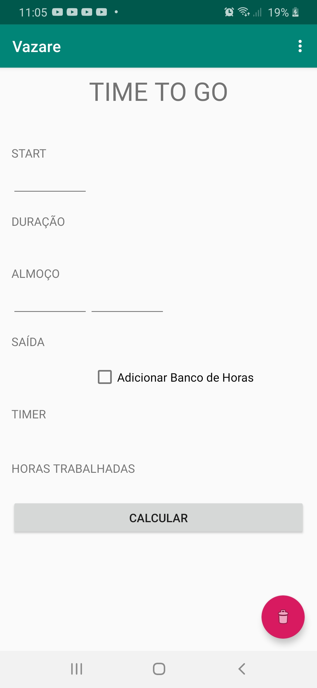
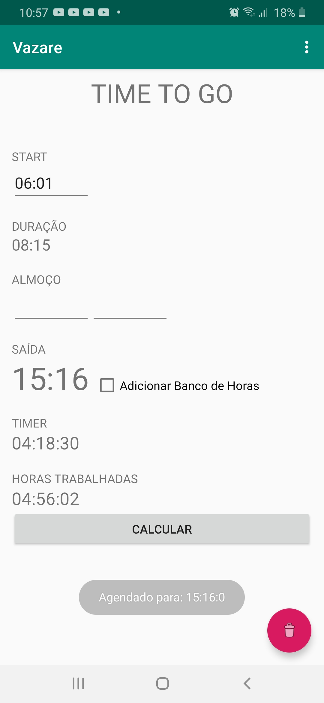
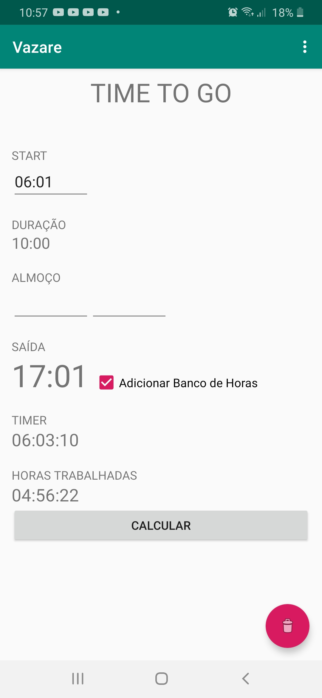
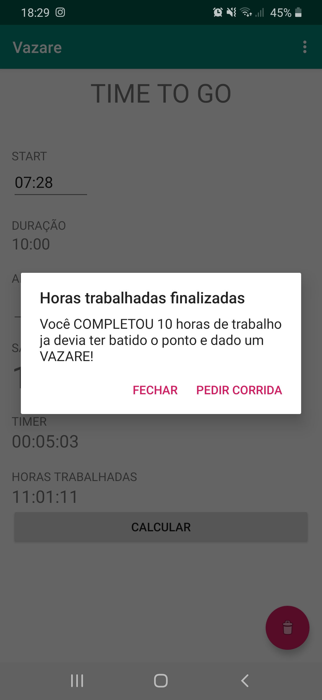
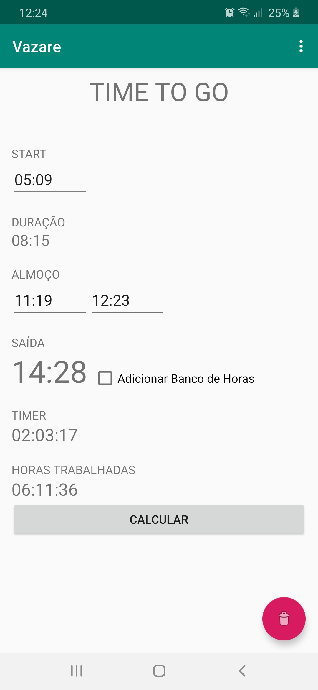
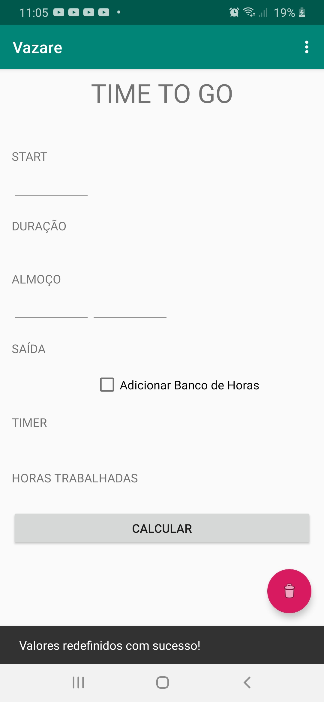

# Layout
     

# Welcome to Vazare App!
Project created to demonstrate some android apps development concepts. (personal) 
This project aims to help employees control their daily workday. 
It counts with the help of a weather forecast of 08:15 for a regular workday, or with a forecast of 10:00 for a day with hour bank. 
Hours that go beyond 10 hours are not allowed, this will cause a possible legal fine for the company. 

# Project
This project make use some technologies requested by market to help in some scenarios that simulate day to day of a android developer.

# Feature
This projecet have the following features in the wich you can to use:
- Previsão de tempo para 8 horas de trabalho sem apontar o almoço.
- Previsão de tempo para 8 horas de trabalho com apontamento  de almoço.
- Previsão de tempo para 10 horas de trabalho sem apontar o almoço.
- Previsão de tempo para 10 horas de trabalho com apontamento de almoço.
- Após finalizar às 8 horas de trabalho o Vazare App exibirá um pop up ou uma notificação com a mensagem "Você completou seu horário de trabalho, você terá duas opções: fechar o pop up, ou Pedir uma corrida(UBER)[SEM CUSTOS PARA A EMPRESA]".
- Após finalizar às 10 horas de trabalho o Vazare App exibirá um pop up ou uma notificação com a mensagem "Você completou seu horário de trabalho, você terá duas opções: fechar o pop up, ou Pedir uma corrida(99Taxi ou  Tocantins Radio Taxi )[COM CUSTOS PARA A EMPRESA]".
- Você pode ver suas horas trabalhadas em tempo real.
- Você pode ver as horas restantes de trabalho, isso lhe ajudará a dar um gás nas atividades.
- No campo duração é sinalizado quantas horas de trabalho está sendo calculada, isso permite a você saber se deve ou não solicitar o banco de horas.
- Você pode ver a hora que pode "bater o ponto" no campo SAÍDA.
- O Vazare App conta com uma ajuda de sistema de notificações no qual irá lhe notificar para que você não exceda as horas de trabalho.
- Limpar todos os campos de uma só vez.

# TODO
- Change layout.
- Change architecture to MMV.
- Save datas daily.
- Add local storage.